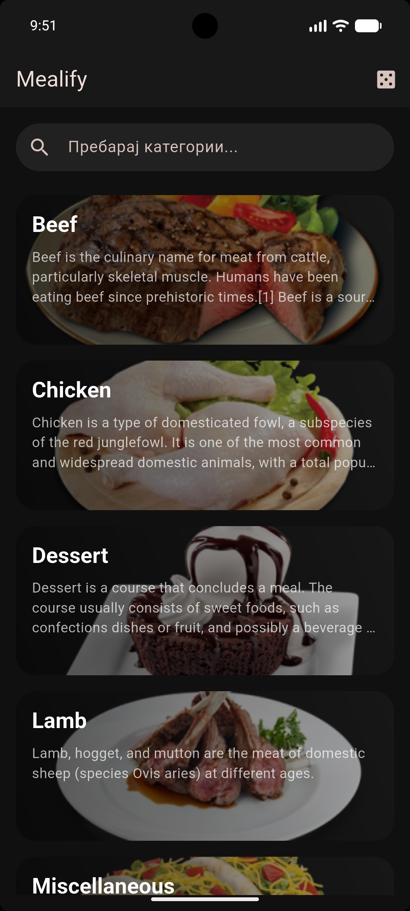
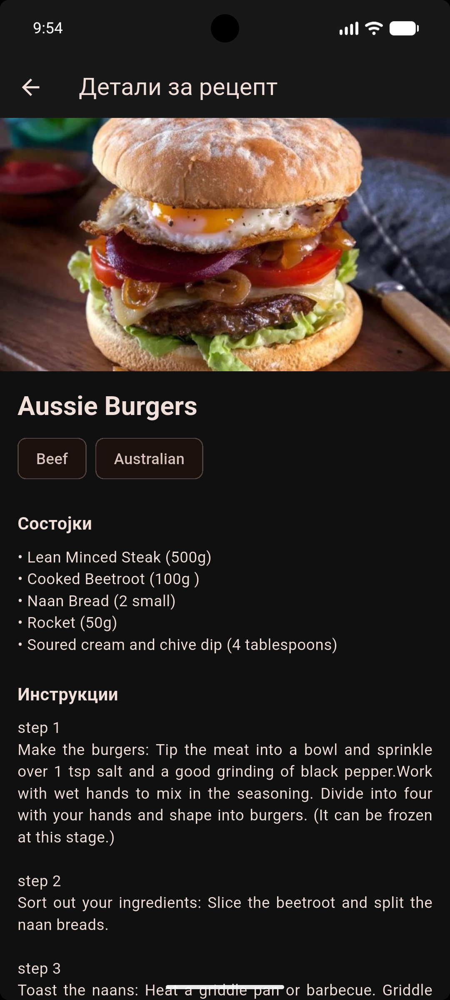

# Flutter Lab 2 - Рецепти

**Index:** 221159  
**Subject:** Мобилни информациски системи  
**Platform:** Flutter  
**Description:** Апликација за приказ и пребарување на рецепти користејќи TheMealDB API.

---

## Преглед на апликацијата

- Прикажува листа од сите категории на јадења со име, слика и краток опис.  
- Овозможува пребарување на категории преку search поле.  
- При клик на категорија се прикажува екран со јадења од таа категорија во grid layout (2 колони).  
- Овозможува пребарување на јадења во рамки на избраната категорија.  
- При клик на јадење се отвора детален приказ со слика, инструкции, состојки и YouTube линк (доколку постои).  
- Во AppBar има копче за „рандом рецепт на денот“ што прикажува целосен рецепт.  
- Кодот е организиран во посебни фолдери: `models`, `services`, `screens`, `widgets`.  

---

## Screenshots

| Categories List | Meals by Category | Meal Detail / Random Meal |
| -------------- | ----------------- | ------------------------- |
|  |  |  |

